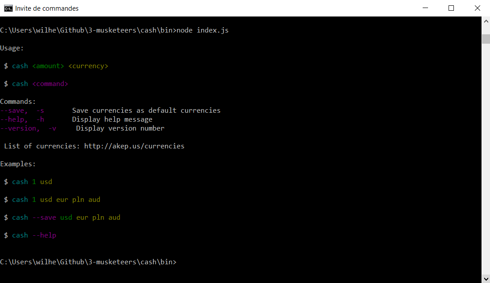

# cash
## Introduction

The aim of this library is to display the value of your money in different currencies. You simply have to enter the amount of the money that you want as an input, and the library will display this amount in several currencies (that can be changed if necessary)

## Structure

This library is composed of tree different files:
		1. cash.js
		2. helpers.js
		3. index.js
	These files are in the cash/bin folder.

	There is also a JSON file that contains the different currencies that will be handeled by the library.

## How do I download the project?

* Fork the project via `github`
* Clone your forked repository project `https://github.com/YOUR_USERNAME/3-musketeers`

```sh
❯ cd /path/to/workspace
❯ git clone git@github.com:*YOUR_USERNAME*/3-musketeers.git
```
* Install nodejs of you don't already have it: https://nodejs.org/en/download/
## Some dependencies to install

The index.js file won't compute at your first attempt, because some dependencies are still missing.
The missing dependencies are:
 1. got
 2. money
 3. chalk
 4. ora
 5. currencies
 6. conf
 7. update-modifier
Therefore, you have to install them with your cmd:

```sh
❯ cd /path/to/workspace
❯ npm install got money chalk ora currencies conf update-modifier
```
Note: you can download them separatly if needed

## How to I run the code?

* Open your comand line and go to the bin file
* Launch the index.js

```sh
❯ cd /path/to/bin/workspace
❯ node index.js
```
As you will see on your comand line, you have several options to in odrer to make the library work, as you can see on the screen below.



The first variable correspond to the amount of money that you want to convert, and the second represent your currency.

## If you want to change your output

* Check the currencies.json file on the cash/lib folder to see which currencies are availiable.
* Execute the index.js file with the --save option, and choose the number and type of currencies.

```sh
❯ cd /path/to/bin/workspace
❯ node index.js --save *currency types needed , separated with a space*
```
